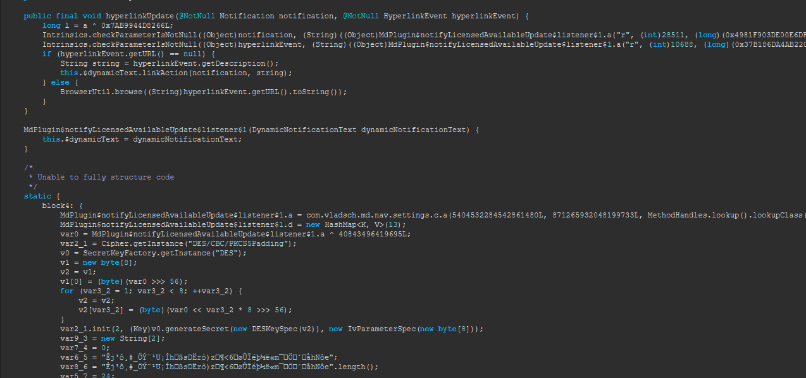
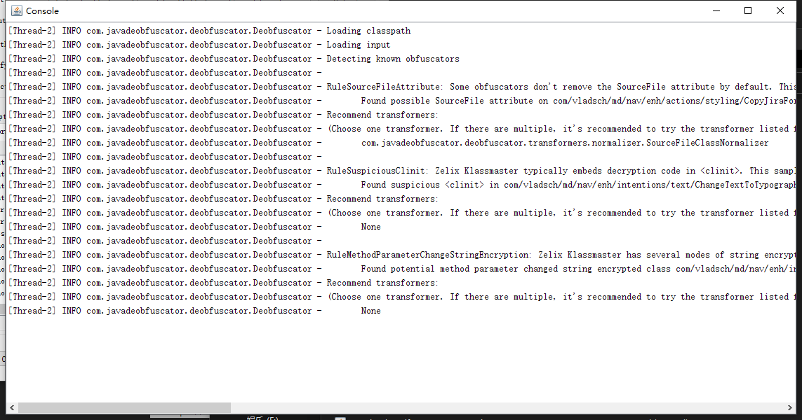
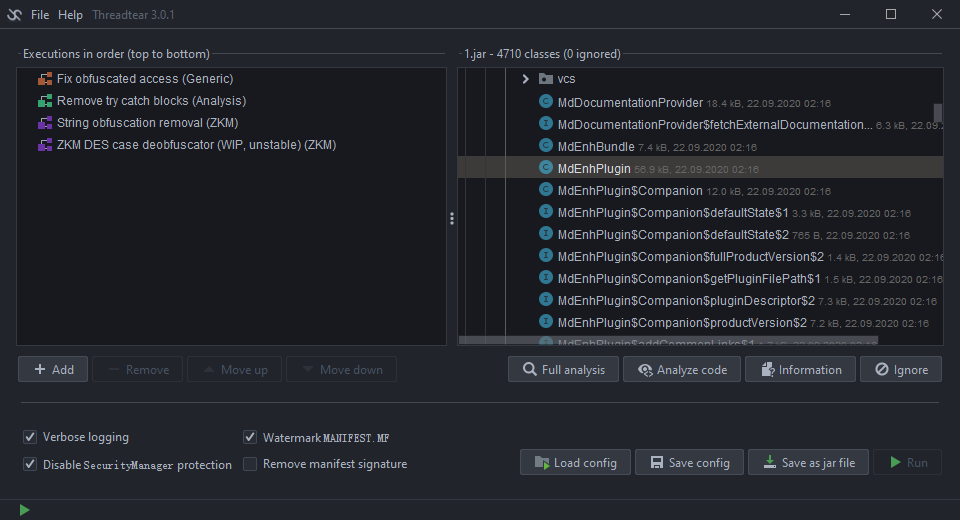
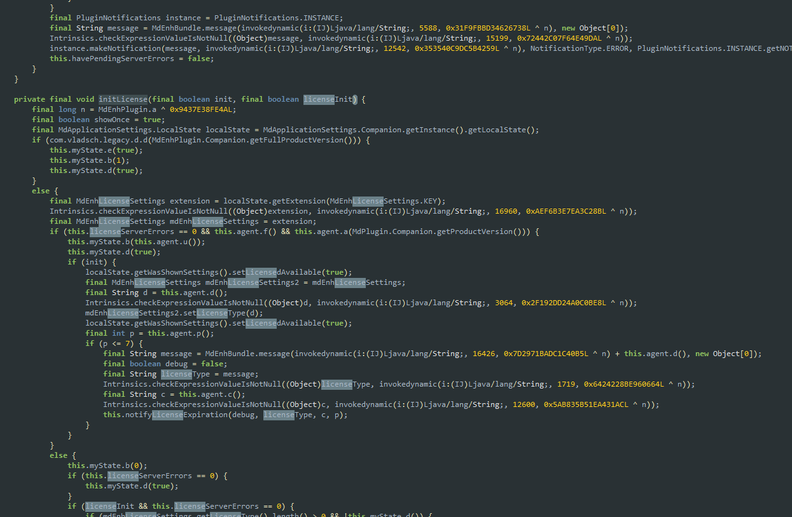
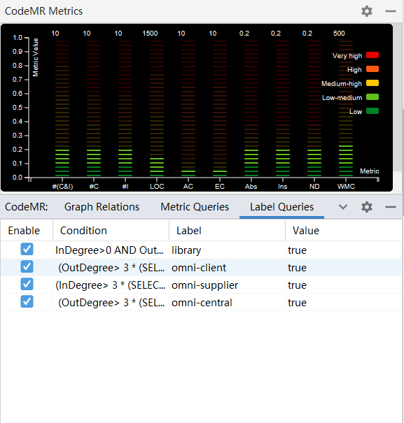

## IDEA 的插件 Repo

### TL;DR

把`https://idea.skactor.com/updatePlugins.xml`添加到 IDEA 的 Repo 中即可在线安装破解过的以下插件

- Markdown Navigator Enhanced
- BashSupport Pro
- CodeMR

### 技术细节

原始插件可以从以下地址进行下载：https://plugins.jetbrains.com/pluginManager/?build=PY-203.6682.86&id=pro.bashsupport&uuid=2065e423-e002-42dd-a93a-c44a49da1a51

IDEA 支持自定义插件仓库，通过这个功能我们能对 IDEA 的一些插件进行破解，同时一次破解到处使用，简直美滋滋

具体原理可以参考：https://plugins.jetbrains.com/docs/intellij/update-plugins-format.html

通过`generate.py`可以生成指定格式的 xml

以破解最新版的 Markdown Navigator Enhanced 为例，经过使用 Recaf+CFR 的简单反编译可以看出来字符串是经过混淆的



看不出来是怎么混淆的，直接用 deobfuscator 进行识别



好消息是识别出来是 Zelix，坏消息是 deobfuscator 目前不支持此种混淆

不过好在我们已经知道是 Zelix 了，zelixkiller 目前已经过时了，现在推荐使用 threadtear

使用命令`java -noverify -jar threadtear-gui-3.0.1-all.jar`启动 threadtear，界面大概是这样的



功能也是非常强大，可以进行很方便进行一些无用信息的清除，可以使用我的配置`config.tcf`

这里有个小 tip，在对这个名为`idea-multimarkdown-lic.jar`的 jar 包进行反混淆时，游湖 ZKM DES 插件用到了一些动态执行的东西，所以所有依赖的类必须都能找到，而这个 jar 包作为 IDEA 的插件依赖了其中的一个名为`extensions.jar`的 Jar 包，具体代码可以参考 IDEA 社区版的代码:https://github.com/joewalnes/idea-community



处理之后的字符串没啥变化，但是至少可读性上升了，聊胜于无吧。。

破解时候需要注意的点有以下几个

- 不要直接使用反编译之后的代码重新打包，直接使用 Recaf 进行字节码修改，避免一些问题
- 除非对 Java 字节码特别熟悉，修改过程中尽量删除逻辑，少添加逻辑
- settingsExtension 和 settingsConfigurableExtension 等 provider 可能有隐藏的激活校验，也需要进行修改，通常来讲直接在 plugin.xml 中进行注释即可
- 根据[IDEA 官方的插件文件结构](https://plugins.jetbrains.com/docs/intellij/plugin-content.html?from=jetbrains.org#plugin-with-dependencies)其实可以看出，普通插件的主 jar 包和压缩包名字是一样的，付费插件会在后面多个`-lic`，所以 jar 包的名字必须把这个去掉才不会进行 key 的校验
- 去掉 plugin.xml 中的`<product-descriptor>`字段

目前还有个问题：

- Markdown 这个插件去除校验之后，获得的是 trail 版的权限

看了看没啥头绪，考虑直接破解认证模块，也就是`com/vladsch/legacy/a`这个类，应该在`legacy-lic.jar`这个包里

### Tips

- 重点特征：com.intellij.ui.LicensingFacade，这个类是插件与IDEA通信的通道
- https://github.com/search?l=Kotlin&q=LicensingFacade&type=Code
- https://github.com/nhat-phan/sentry-integration/blob/ce937bbb5ec9328dd4008bbefcef6b2734503685/sentry-integration-idea/src/main/kotlin/net/ntworld/sentryIntegrationIdea/license/IntellijCheckLicense.kt

```
// 直接返回true
DEFINE STATIC b()Z
ICONST_1
IRETURN
```

### 修改记录

### Markdown Navigator Enhanced

- com.vladsch.legacy.a所有返回值为boolean型的都返回true
- com.vladsch.legacy.f所有返回值为boolean型的都返回true
- 去掉plugin.xml里面的<product-descriptor>
- 这样就获得了完整授权

### CodeMR

- com.codemr.intellij.extractors.e的a、b、c、d四个方法直接返回true
- 去掉plugin.xml里面的<product-descriptor>



#### bashsupport pro

- pro.bashsupport.d5 的a、b、c、d四个方法直接返回true
- pro.bashsupport.abc 的 b 方法直接返回 true
